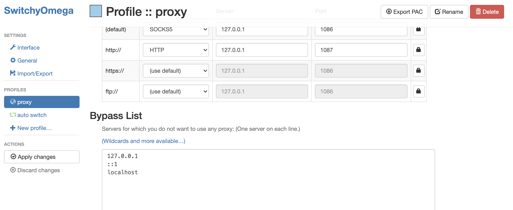

* How to install v2ray?
    * download v2rayU from  https://github.com/yanue/V2rayU/releases
    * set socket5 port and pac port
        
    * set http proxy port
        
    * advance setting
        
    * set switchyomega
        
        
    * successful example
        