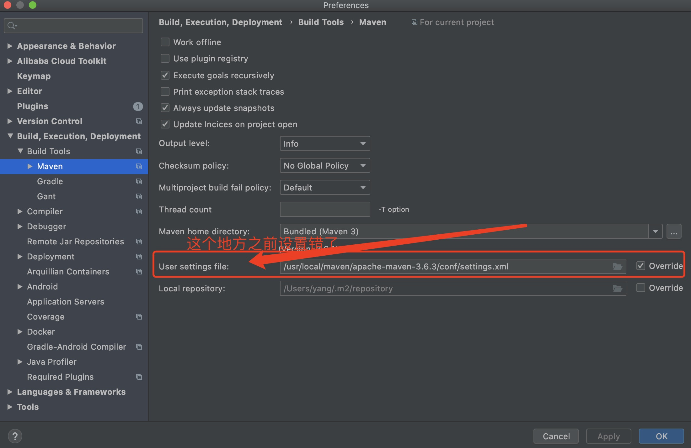

* Install Maven In Mac
    * Download maven from http://maven.apache.org/download.cgi
    * sudo cp -R apache-maven-3.6.3 /usr/local/maven/ 
    * vim ~/.zshrc
        *  export M3_HOME=/usr/local/maven/maven-apache-3.6.3
        *  export PATH=$M3_HOME/bin:$PATH
    * source ~/.zshrc
* where is mvn config?
    * /usr/local/maven/maven-apache-3.6.3/config/settings.xml
* How to Config Maven?
    * You will see config/settings.xml directory in Maven Home
    * Refer to settings-newhouse.xml
* why does the jar library is downloaded from central repo in intellij?
    * The reason is that you should config the setting file mannualy
    * screenshot can be seen 
