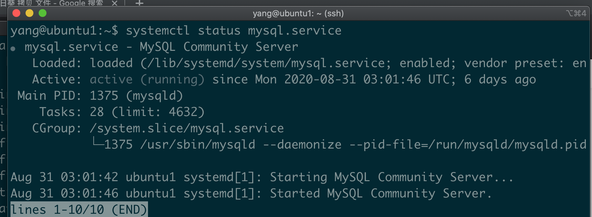
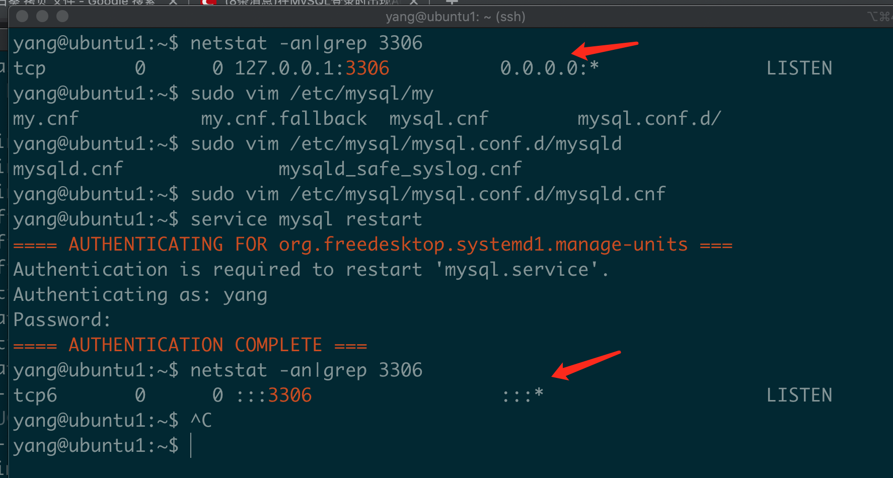

* windows安装的Mysql如何可以被外网访问？
* Ubuntu 
  * 安装 Mysql?
    * sudo apt-get update
    * sudp apt-get install mysql-server
  * 检查mysql的状态
    * systemctl status mysql.service
    
  * 查看Mysql版本
    * mysql -V
  * 如何设置mysql的密码？
    * sudo mysql_secure_installation
  * 如何命令行登陆mysql?
    * mysql -uroot -p
    * 奇怪的地方：输入任何密码都可以
    * 验证 - 亲测有效
      * use mysql;
      * select * from user;
  * 如何彻底卸载mysql
    * sudo apt-get remove --purge mysql-\*
    * 找出剩余的文件，然后删除
      * sudo find  / -name mysql -print
  * 如何外网访问mysql?
    * 更新配置文件
      * 查看3306是否开放？
        * netstat -an|grep 3306
        * 具体正确的结果看 3306.png
      * sudo vim /etc/mysql/mysql.conf.d/mysqld.cnf 或者 sudo vim /etc/my.cnf
      * 注释掉 bind-address = 127.0.0.1
      * 在[mysqld]下面添加: port = 3306
      * 重启mysql: service mysql restart
      * 查看结果 3306的状态
        
    * 如何是阿里云要设置安全组，见安全组.png
    * 更新用户表 - %代表root允许任意的主机访问
      * use mysql;
      * update user set host='%' where user='root';
      * flush privileges;
      * service mysql restart
    * 按照下面这个链接操作，在亲测成功 - 版本5.7.33
      * https://zhuanlan.zhihu.com/p/61459645
      * 注意事项
        * 不知道是哪一步导致了之前不能连接
        * 默认密码是11111111
        * 没有设置任何的全局变量
        * 没有设置任何的跳过域名
        * 将/etc/mysql/mysql.conf.d/mysqld.cnf里面的bind-address 注释掉
        * 仅仅更新了root的host为%
        * 仅仅执行了GRANT ALL PRIVILEGES ON *.* TO 'root'@'%' IDENTIFIED BY '11111111' WITH GRANT OPTION;
* Debian 安装 Mysql?
* Centos 安装 Mysql?
