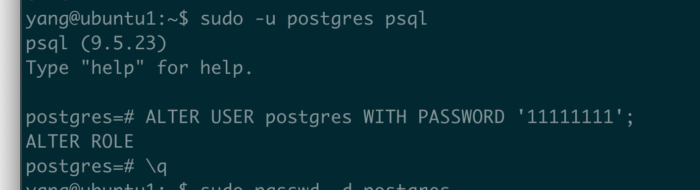
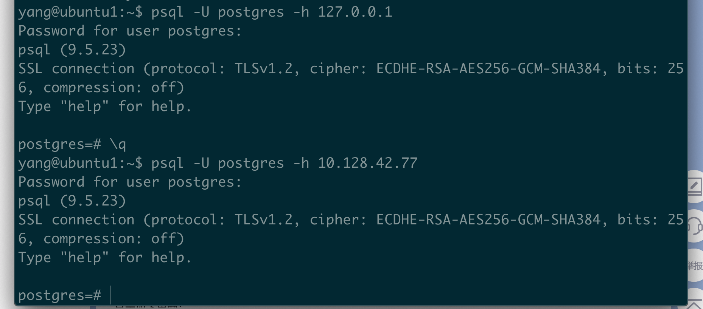

* Ubuntu/Debian
  * 如何安装Postgres?
    * sudo apt update
    * sudo apt install postgresql postgresql-contrib
  * 安装好了之后，如何查看PostGres?
    * service postgresql status
  * 如何启动 postgres?
    * sudo /etc/init.d/postgresql start 
    * 或者 sudo systemctl start postgresql
  * 如何设置Postgres密码？
    * sudo su postgres
    * psql -U postgres
    * alter user postgres with password 'yang$1111';
    * 
  * 如何退出postgres的命令行？
    * \q 按回车
  * 如何查看postgres版本？
    * psql --version
  * 如何登陆本地数据库或远程数据库？
    * psql -U postgres -h 127.0.0.1
    * 
  * 如何设置外网客户端可以可以连接？- 版本10.16 亲测有效
    * sudo vim /etc/postgresql/[XXX]/main/postgresql.conf
      *  取消注释: listen_addresses = ‘*’
      *  取消注释：password_encryption = on, 某些版本是password_encryption = md5
    * sudo vim /etc/postgresql/[XXXX]/main/pg_hba.conf
      * 在文件末尾添加 host all all 0.0.0.0 0.0.0.0 md5
    * 重启： sudo systemctl restart postgresql
    * 测试： psql -U postgres -h [ipaddress]
  * 踩坑记
    * 黑客通过postgress种植了挖矿程序
      * 采取措施：修改密码为yang$1111
* Centos