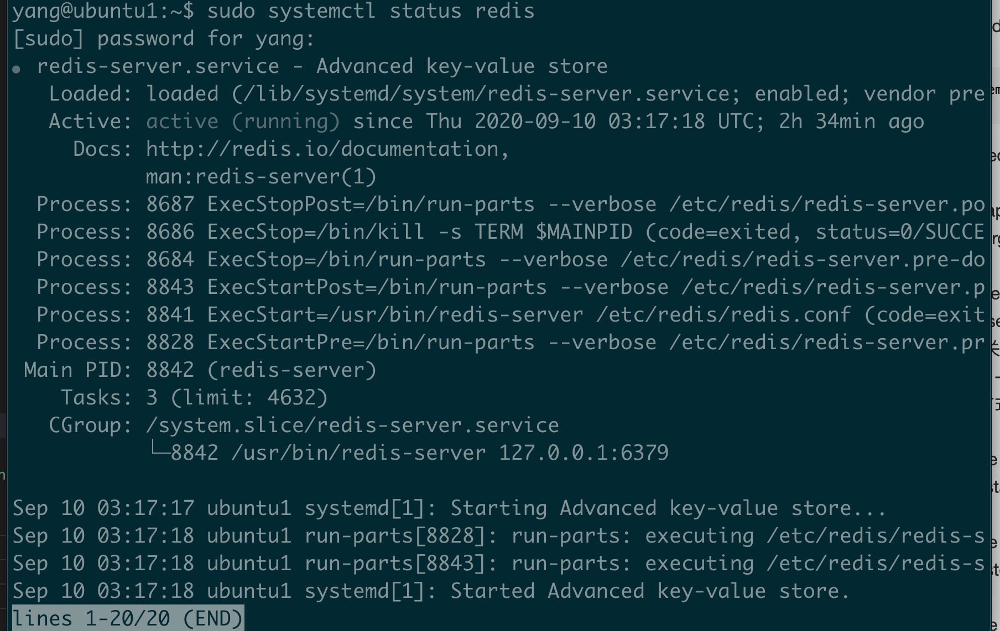
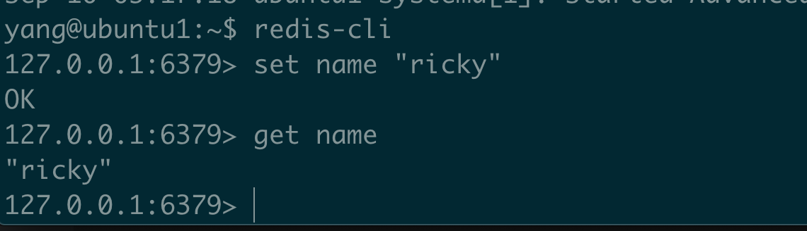
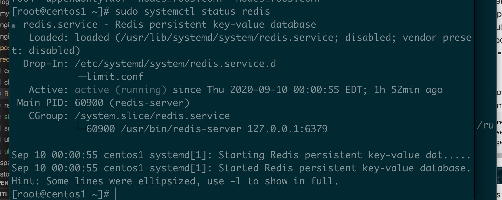

* Ubuntu/Debian
  * 如何安装 redis-server?
    * sudo apt install redis-server
  * 如何查看redis状态？
    ```
    sudo systemctl status redis
    ```
    
  * 如何卸载 redis-server?
    * sudo apt-get purge --auto-remove redis-server
  * 如何启动/关闭/重启redis? -- 非源码安装方式
    * sudo service redis start
    * sudo service redis stop
    * sudo service redis restart
  * Service Operation -- build by source code
    * ./redis-server ../redis.conf
  * How do a simple test?
    ```
    redis-cli
    set name "ricky in linux"
    get name
    ```
    
* Centos
  * 如何安装redis?
    * sudo yum install epel-release
    * sudo yum update
    * sudo yum install redis
    * sudo service redis start
  * 如何卸载Redis？
    * yum remove redis
  * 如何查看redis状态？
    ```
    sudo systemctl status redis
    ```
    
* 如何创建Redis集群?
  * create directory
  ```
  mkdir /opt/redis/redis-cluster
  cd /opt/redis/redis-cluster && mkdir 7000 7001 7002
  ```
  备注：第一台机器上的目录是7000， 70001， 7002， 那2台机器上的目录就是7003, 7004, 7005, 以此类推
  * 修改 redis.conf文件
    * centos: vim /etc/redis.conf-> 修改bind 127.0.0.1 为真实的地址
    * ubuntu/debian: vim /etc/redis/redis.conf
      * 会看到文件为空， 执行sudo chmod 755 /etc/redis/redis.conf
      * 
  * copy redis.config to directory 7000, directory 7001, directory 7002
  * update config based on 7000, 7001, 7002
  * start redis instance-三台机器上分别执行，注意修改参数
  ```
  for((i=0;i<=2;i++)); do /opt/redis/bin/redis-server /opt/redis/redis-cluster/700$i/redis.config; done
  ```
  * create cluster
    ```
    cd /opt/redis/bin
  ./redis-cli --cluster create 10.128.42.77:7000 10.128.42.77:7001 10.128.42.77:7002 10.128.42.153:7003 10.128.42.153:7004 10.128.42.153:7005 10.128.42.129:7006 10.128.42.129:7007 10.128.42.129:7008 --cluster-replicas 1
    ```
  * Verify cluster
    run cmd in one machine
    ```
    ./redis-cli -h 10.128.42.77 -c -p 7000
    ```
    run cmd in other machine
    ```
    ./redis-cli -h 10.128.42.129 -c -p 7007
    ```
  * useful commands 
    * cluster info
    * cluster nodes
  * view node infomation
    * ip:port is any available address
    ```
    ./redis-cli --cluster check 10.128.42.129:7006
    ```
* How to verify reids status?
  * ps -ef | grep redis
  * netstat -tnlp | grep redis 
* How to kill a redis instance?
  * kill -9 22292